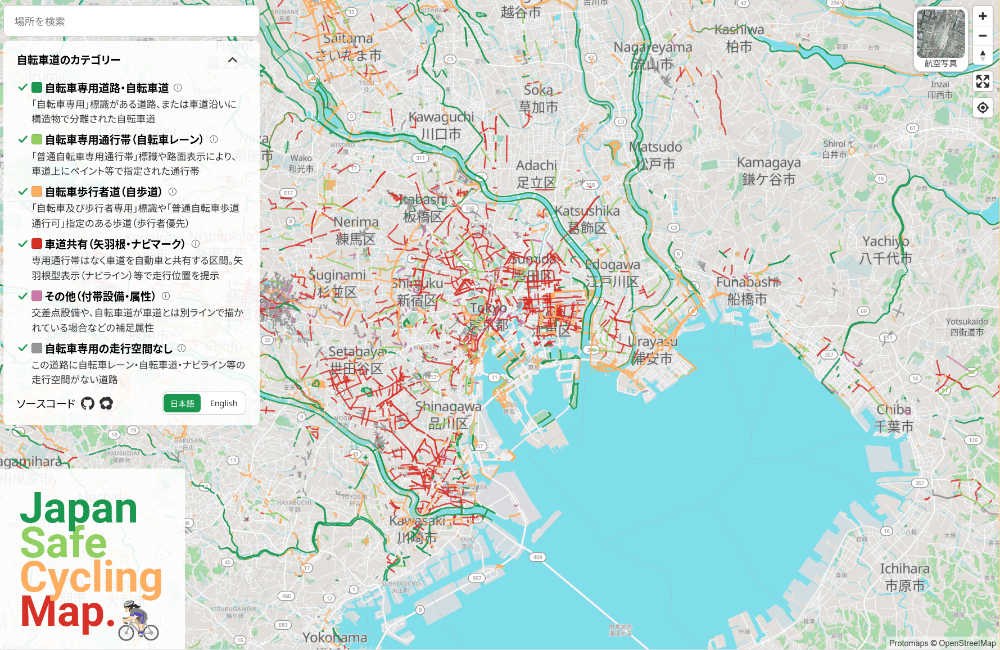
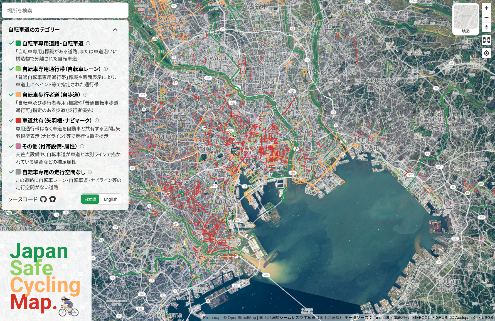
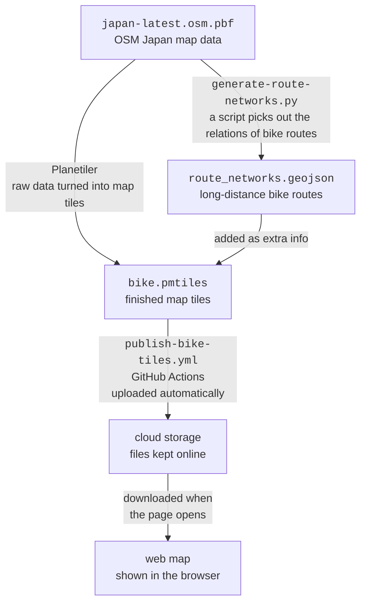

# Japan Safe Cycling Map
Japan-focused cycling roads map built on OpenStreetMap (OSM) data. Inspired
by [jakecoppinger/safe-cycling-map](https://github.com/jakecoppinger/safe-cycling-map), focused on Japanese road conventions.

<figure style="display: flex; gap: 1rem; align-items: flex-start; margin: 0;">
  <div>
    
    <figcaption>Street map view</figcaption>
  </div>
  <div>
    
    <figcaption>Satellite view</figcaption>
  </div>
</figure>

Overlays a color-coded bike infrastructure layer on a sharp basemap. Click or
hover a line to see the actual OSM tags behind it. The street basemap is served
by [Protomaps](https://protomaps.com). An aerial mode switches to a
[GSI Japan satellite
hybrid](https://maps.gsi.go.jp/development/ichiran.html) 
via the basemap switcher.

Legend categories for bake roads in Japan:

-  自転車専用道路・自転車道 (dedicated cycleways)
-  自転車専用通行帯 (cycle lanes)
-  自転車歩行者道 (shared footpaths)
-  車道共有 (shared lanes / sharrow markings)
-  その他 (crossings, ASLs, separated lines)
-  自転車専用の走行空間なし (roads without dedicated cycling space)

## Data Flow



1. Download the Japan OSM extract (`data/japan.osm.pbf`) from [Geofabrik](https://download.geofabrik.de/asia/japan-latest.osm.pbf).
2. Resolve `route=bicycle` relations (networks `icn`/`ncn`/`rcn`/`lcn`) into
   `data/route_networks.geojson` with
   [scripts/generate-route-networks.py](scripts/generate-route-networks.py)
   (pyosmium), since Planetiler can't resolve relations onto member ways.
3. Build the overlay `public/bike.pmtiles` (z0–z16) with Planetiler
   ([scripts/build-bike-overlay.sh](scripts/build-bike-overlay.sh), schema
   [scripts/planetiler/bike-schema.yml](scripts/planetiler/bike-schema.yml)),
   using both the OSM extract and the route GeoJSON as sources.
4. Upload `public/bike.pmtiles` (>20MB) to the cloud storage from GitHub Actions
   [.github/workflows/publish-bike-tiles.yml](.github/workflows/publish-bike-tiles.yml).

## Development

```shell
nvm install
npm i --legacy-peer-deps
npm run start  # dev server at http://localhost:5000
```

## Deploy

The bile road tile is published to cloud storage from GitHub Actions
workflow. The site itself deploys to GitHub Pages on push
to `feat/japan-safe-cycling-map` branch, reading the bike tile from the cloud storage URL set in
`REACT_APP_BIKE_PMTILES_URL`.

## Not implemented

- The original project's street safety rating calculation is not part of this
  rewrite (yet).
- The rust-based `osm2streets` vector tile rendering from the original repo is not used.

## Disclaimer

OSM data is incomplete and should not be relied on in ways where errors could
cause harm. Contribute fixes directly to OpenStreetMap.

## License

GNU AGPL v3
